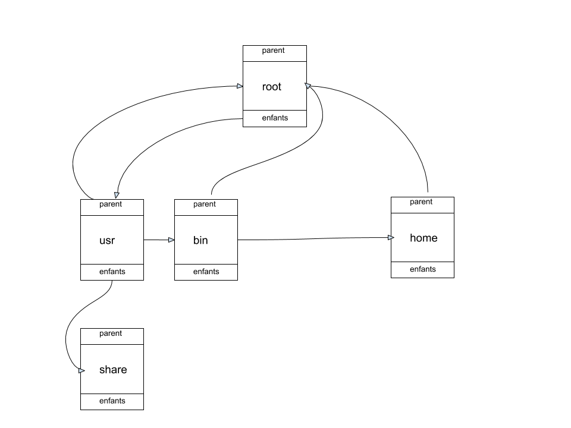

# Méthodologie de la Programmation - Projet 2019/2020 - Système de gestion de fichiers

## <b>Résumé</b>

L'objectif de ce rapport est de mettre en avant les différentes étapes et décisions conceptuelles prises lors de la réalisation d'un système de gestion de fichiers. Tout d'abord nous commencerons par une introduction du sujet, puis nous verrons les principaux choix réalisés, nous continuerons sur les diffcultés rencontrées lors de ce projets pour enfin finir sur un bilan technique et personnel de mon experience sur ce projet.

## <b>Introduction</b>

Ce projet à pour but de créer un système de gestion de fichiers en langage ADA. <i>"Un système de gestion de fichiers (SGF) est une manière de stocker les informations et de les organiser dans des fichiers"</i> [...] <i>"Une telle gestion des fichiers permet de traiter, de conserver des quantités importantes de données ainsi que de les partager entre plusieurs programmes informatiques. Il offre à l'utilisateur une vue abstraite sur ses données et permet de les localiser à partir d'un chemin d'accès."</i> ([Wikipedia - Système de fichiers](https://fr.wikipedia.org/wiki/Syst%C3%A8me_de_fichiers)). Afin de réaliser ce SGF, j'ai donc cherché à recréer une structure d'arbre avec une racine '/' et quelques commandes permettant d'effectuer des actions simples sur cette structure.

## <b>Plan du document</b>

- Introduction
- Présentation de l'architecture
- Présentation des choix principaux
- La démarche de test
- Les difficultés rencontrées
- Bilan technique et personnel

## <b>Présentation de l'architecture</b>

Comme spécifié dans le sujet de ce projet, je suis parti sur une structure d'arbre pour réaliser mon SGF. Cet arbre ne possède qu'un seul type de noeud, la différence entre un fichier et un dossier ce fait donc par les différents attributs de ce noeud.
Un noeud de l'arbre possède donc les différents éléments :
- un nom
- des metadonnées
- une liste de noeuds enfants
- un noeud parent

On peut donc représenter la structure de mon arbre par le schéma suivant:

<strong>Remarque :</strong> On notera que le noeud 'usr' n'a pas connaissance du lien qui le relie au noeud 'bin' mais par contre, son parent 'root' en à la connaissance (root possède une liste d'enfants).

Afin de réaliser cette structure, j'ai donc créer un total de 5 modules :
- Un module de listes doublement chainées
- Un module de métadonnées
- Un module d'arbre
- Un module de commandes
- Un module de fonctions relatives aux commandes

### <u>Les listes doublement chainées</u>

Ce module rencense la structure de donnée d'une liste doublement chainée ainsi que toutes les opérations nécéssaire a son utilisation dans le cadre de mon projet, c'est à dire le stockage des enfants d'un noeud ainsi que pour le stockage des chemins d'accès au noeuds. Ce module est générique.

### <u>Les métadonnées</u>

Les métadonnées d'un noeud sont ses différentes informations, dans mon cas, elles contiennent l'extension du fichier (si le noeud est est fichier), les droits utilisateurs du noeud ainsi que sa taille sur le disque.

### <u>Le module d'arbre</u>

C'est dans ce module qu'est recensée la structure de l'arbre ainsi que les fonctions et procédures qui seront ensuite utilisées pour créer les commandes du SGF. C'est le module principal du projet autout duquel tout s'articule.

### <u>Les commandes</u>

C'est dans ce module que sont créées les 6 commandes que l'on peut utiliser dans notre SGF. Ces commandes sont les suivantes :
- mkdir : Permet de créer un dossier
- touch : Permet de créer un fichier
- cd : Permet de changer de dossier
- vim : Permet de modifier la taille sur le disque d'un fichier
- pwd : Permet d'afficher le chemin absolu du dossier courant
- ls : Permet de lister les enfants du dossier courant

### <u>Les fonctions relatives aux commandes</u>

C'est dans ce module que se trouvent deux fonctions essentielles pour le bon fonctionnement du SGF : la fonction de split, qui va découper, en fonction d'un charactère, une chaine de caractères en une liste doublement chainée de chaine de caractères; et la procédure d'interpréation des commandes, qui en fonction de ce qui est tappé au clavier par l'utilisateur, execute les bonnes commandes.

## <b>Présentation des choix principaux</b>

Dans la partie précedente, nous avons eu une idée globale de comment étaient agencés les différents modules du projet, cette partie va donc définir ce qui à amené à leur conception.

### <u>La liste doublement chainée : Une structure de donnée dynamique</u>

Comme vu précedement, j'ai utilisé des listes doublement chainées pour stocker les enfants d'un noeud ou bien les chemins d'accès.
Au début du projet, je me suis posé la question de savoir quelle était la structure de données la plus pertinente afin de stocker des noeuds ou des chemins vers des noeuds : j'ai directement pensé à l'utilisation d'un tableau, cependant cette structure de données n'étant pas dynamique, l'idée de devoir définir soit une taille limite aux nombre d'enfants d'un noeud ou bien au nombre de dossiers d'un chemin d'accès ne me convenait pas, de même pour définir un nombre très grand afin de ne pas être limité mais posant alors un problème de mémoire.  
Je me suis donc tourné ver l'idée d'utiliser une structure de donnée dynamique, telle qu'une liste simplement chainée, choix que j'ai choisi au départ, puis pour des raisons pratiques de parcours de mes listes, je me suis ensuite tourné vers l'implémentation de listes doublement chainées.
Au final, la liste doublement chainée répond à toutes mes attentes : permettre un parcours facile de ma structure de données, tout en étant dynamique.
 
Pour finir sur ce point de conception, je dirais que j'ai implémenté ce module de façon générique afin de pouvoir l'utiliser pour stocker des noeuds de mon arbre ainsi que pour stocker des chaines de caractères correspondant aux chemins d'accès.

### <u>Les chaines de caractères</u>

Ce type de données étant utilisé très fréquement dans mon SGF (noms des noeuds, extensions de fichiers, chemins d'accès etc...), j'ai donc choisi d'opter pour le type "Unbounded_String" d'ADA, qui permet de palier au fait de devoir définir un nombre de caractères maximal que contient votre chaine de caractère, problème posé par le type "String" de base d'ADA. J'ai donc préféré utiliser les "Unbounded_String" plutôt que les "String" pour les mêmes raisons que j'ai préféré utiliser des listes plutot que des tableaux.

### <u>La séparations des modules</u>

Comme vous l'avez vu, j'ai préféré avoir un module d'arbre et un module de commandes, plutôt qu'un seul module regroupant les deux, qui était mon idée de base. Au final j'ai préféré séparer ces deux modules afin de simplifier la créations de nouvelles commandes. En effet dans le module d'arbres, les opéartions sont génériques au noeud et non à un fichier ou à un dossier. Cela permet de définir un ensemble d'opérations simples dans le modules d'abre permettant de réaliser rapidement tout type de commandes par la suite. 
Actuellement, je ne possède que 6 commandes dans mon module de commande car je n'ai pas eu le temps d'en réaliser plus. Cependant grâce à mon implémentation du module d'arbre, je peux réaliser d'autres commandes telles que rm, cp, mv etc... de manière simple et rapide.

### <u>Le noeud de l'arbre et les pointeurs</u>

Dans ce projet j'ai choisi de créer un seul noeud qui englobe la spécification de fichier et de dossier car j'ai jugé au départ que la réalisation des différentes opérations sur ces noeuds serait plus simple qu'en les séparant en deux noeuds distincts car cela impliquerait de doubler l'implémentation de chaque opérations (avoir un 'add' pour un fichier et un 'add' pour un dossier au lieu de un seul 'add' pour un noeud). Durant le projet, l'un des intervenant m'avait prévenu que les opérations serait donc plus difficiles à implémenter en utilisant un seul noeud, mais au final je n'ai pas rencontré de problèmes particuliers. 
Pour ce qui est des pointeurs, étant donné que je n'ai qu'un seul noeud pour les fichier et les dossier, chaque noeud possède un pointeur vers son dossier parent ainsi qu'un pointeur vers sa liste d'enfants, ce dernier n'étant pas utile pour les fichiers.

### <u>La specification et les raffinages</u>

Dans mon code, j'ai fait le choix de ne pas faire la spécification et le raffinage de toutes les opéarations de mes modules, de un par manque de temps mais surtout car j'ai jugé que faire de la spécification ou du raffinage dans le seul but d'en faire était inutile voir même contre productif : en effet, à mon sens, faire le raffinage ou écrire la spécification d'opérations triviales est une perte de temps, temps qui pourrait être utilisé ailleurs. 
C'est pourquoi, dans mon code, vous ne trouverez que la spécifications des opérations qui ne sont pas compréhensibles par leur noms (par exemple, vous arrez la spécification de la méthode 'get_and_delete_last' mais pas celle de la fonction 'length' sur une liste). Il en va de même pour le raffinage : vous le trouverez seulement pour expliquer les opérations dont il est difficile de les comprendre à première vue.

### <u>Le menu et l'invite de commandes</u>

Encore une fois, par manque de temps, je n'ai réalisé que l'invite de commande, que j'ai jugé bien plus intéréssante à réaliser que le menu de commandes. De plus, une fois l'invite de commandes réalisées, faire le menu de commandes n'est pas compliqué mais prends trop de temps pour ce qu'il apporte en réalité.

## <b>La démarche de test</b>

Mon approche pour les tests pour ce projet était de réaliser des tests pour chaques cas d'utilisations et chaques cas d'exceptions de chaque opérations de mes modules. De ce fait, lors de l'implémentation de mes différentes méthodes et fonctions, je les testais dans mon programme principal pour vérifier qu'elles fonctionnaient correctement. Je comptais, à la fin du projet, réaliser des fichiers de tests unitaires pour chaques modules afin d'illustrer ces tests. Malheuresement, par manque de temps, je n'ai pas pu réaliser ces fichiers de tests.

## <b>Les difficultées rencontrées</b>

Pour ce qui est des difficultés rencontrées durant ce projet, je n'en ait rencontrée qu'une majeure : la gestion de mon temps. 
En effet, je me suis lancé dans le projet avec une idée claire de ma structure et des différents modules que j'aillais utiliser, même si cela à été voué à évolué durant ce projet, je ne me suis pas confronté à des difficultées m'empéchant d'avancer. Cependant, la gestion de mon temps et mon estimation du temps à passer sur chaque étapes de ce projet à été désastreuse, ainsi je n'ai pas pu finir le projet comme je l'aurais voulu, avec au final un nombre de commandes inférieure à mes espérances ainsi que des spécifications, raffinages et tests qui ne sont pas complet ou qui ont été omis...

## <b>Bilan technique et personnel</b>

### <u>Technique</u>

D'un point de vue technique ce projet m'a montré que les techniques de la méthodologie de la programmation sont très utiles afin de définir des étapes claires à réaliser lors de la réalisation d'un projet conséquent, mais il m'a aussi montré l'utilité de la spécification et du raffinage pour réaliser de manière simple des opérations compliquées.

### <u>Personnel</u>

D'un point de vue personnel, ce projet m'a permis de m'appercevoir que je gérais très mal mon temps, que je voyais trop grand au départ et que j'étais trop perfectionniste : en effet durant ce projet je me suis retrouvé plusieurs fois à perdre beaucoup de temps pour réaliser des fonctionnalités secondaires ou inutiles techniquement parlant, ce qui m'a amené à ne pas finir comme je l'aurais voulu ce projet.

### <u>Temps passé au projet</u>
- Conception : ~10h
- Implantation : ~35h
- Mise au point : ~10h
- Rapport & Manuel d'utilisateur : ~5h

